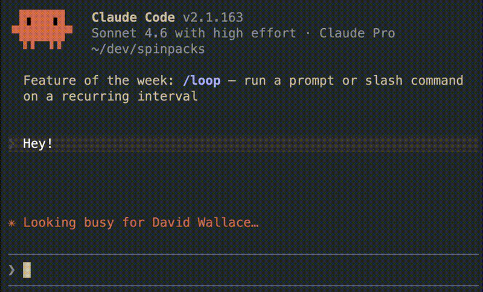

<div align="center">
  <h1>Spinpacks</h1>
  <p><b>Because waiting for LLM generation should never be boring.</b></p>

  [](https://github.com/VasylRomanets/homebrew-tap)
  [](https://claude.ai/code)
  [](LICENSE)

  
</div>

<br />

Apply themed spinner verb packs to [Claude Code](https://claude.ai/code). Replace or extend the default loading messages with custom phrases from themed packs — currently ships with a _The Office_ pack.

```
$ spinpacks install the-office
Installed 'the-office' in user scope — 230 verbs active

$ spinpacks sample the-office -n 3
Schruting it
Being Prison Mike
That's what she said
```

## Installation

### Homebrew (recommended)

```sh
brew tap VasylRomanets/tap
brew install spinpacks
```

### Manual

```sh
git clone https://github.com/VasylRomanets/spinpacks.git
# Add the bin directory to your PATH, or symlink the executable:
ln -s "$(pwd)/spinpacks/bin/spinpacks" /usr/local/bin/spinpacks
```

## Quick start

```sh
# See what packs are available
spinpacks list

# Install a pack into your user-wide Claude Code settings
spinpacks install the-office

# Preview verbs before installing
spinpacks sample the-office -n 5

# Check what's currently active
spinpacks status

# Remove a pack
spinpacks uninstall the-office
```

## Usage
```
$ spinpacks help
Usage: spinpacks <command> [pack] [options]

Commands:
  list, ls                    List available packs (--installed filters to installed; -v shows verb count)
  install, add <pack>         Install a pack into Claude Code settings (merges with existing verbs)
  uninstall, remove [<pack>]  Remove a pack (or --all) from Claude Code settings
  update [<pack>]             Reinstall pack(s) (all tracked if no pack given)
  status                      Show active verbs, mode and tracked packs (--all shows every scope)
  mode [replace|append]       Get or set Claude Code's spinnerVerbs.mode
  sample <pack> [-n N]        Print N random verbs from a pack (default: 1)
  info, show <pack>           Show pack details and a sample of verbs (-v lists all)
  search <text>               Search packs by name, description, tags, or verb content (-v shows matching verbs)
  doctor                      Check for configuration problems
  version                     Print version
  completion <shell>          Generate shell completion (bash, zsh, fish)
  help [command]              Show help [for

Options:
  --scope SCOPE      Target scope: user (default), project, local, managed
  --force            Skip safety guards (remo
  --all              Operate on all tracked packs (uninstall/update) or all scopes (status)
  --installed        Filter list to only instto one scope)
  --dry-run          Show what would change without writing anything
  -v, --verbose      Show detailed output
  -q, --quiet        Suppress non-error output (write commands only)
  --json             Output as JSON
  --no-color         Disable color output
  -n, --count COUNT  Number of verbs to sampl
  -V, --version      Print version
  -h, --help         Show this help message

Environment:
  NO_COLOR           Disable color output when set (any value)
  CLAUDE_CONFIG_DIR  Override Claude Code's cclaude)
```

Run `spinpacks help <command>` for detailed usage of any command.

## Scopes

spinpacks writes to Claude Code's [settings files](https://docs.anthropic.com/en/docs/claude-code/settings). The `--scope` flag controls which file is modified:

| Scope | File | When to use |
|---|---|---|
| `user` (default) | `~/.claude/settings.json` | Applies to all your projects |
| `project` | `.claude/settings.json` | Applies to the current project (commit to share with team) |
| `local` | `.claude/settings.local.json` | Per-project, never committed |
| `managed` | `/Library/Application Support/ClaudeCode/managed-settings.json` | Managed/enterprise |

```sh
# Install into the current project only
spinpacks install the-office --scope project

# See all scopes at once
spinpacks status --all
```

## Shell completions

Homebrew users get completions installed automatically — no extra steps needed.

For manual installs, generate and install the completion script for your shell:

```sh
# zsh — add to fpath, then run compinit
spinpacks completion zsh > ~/.zsh/completions/_spinpacks

# bash — source in ~/.bashrc
spinpacks completion bash >> ~/.bashrc
source ~/.bashrc

# fish
spinpacks completion fish > ~/.config/fish/completions/spinpacks.fish
```

## Pack format

A pack is a single JSON file in the packs directory. It is a JSON object with a required `verbs` array and optional metadata fields:

```json
{
  "description": "A short description of the pack",
  "author": {
    "name": "Your Name",
    "url": "https://github.com/you"
  },
  "tags": ["category", "theme"],
  "verbs": [
    "Doing the thing",
    "Making it happen",
    "Crunching numbers"
  ]
}
```

| Field | Required | Description |
|---|---|---|
| `verbs` | Yes | Array of verb strings shown in Claude Code's spinner. Short phrases (2–6 words) look best. |
| `description` | No | One-line summary shown by `list -v` and `info` |
| `author.name` | No | Name of the person who created the pack |
| `author.url` | No | Link to the author's profile or homepage |
| `tags` | No | Search keywords used by `search`; use spaces not hyphens (e.g. `"the office"`, not `"the-office"`) |

Once the file is in the packs directory, run `spinpacks install <name>` to activate it.

## Contributing

Contributions are welcome — new packs especially.

1. Fork the repository
2. Add `packs/<name>.json` following the pack format above
3. Open a pull request

Please run `spinpacks doctor` before submitting to confirm your files are valid.

## License

MIT — see [LICENSE](LICENSE).

Copyright (c) 2026 Vasyl Romanets
